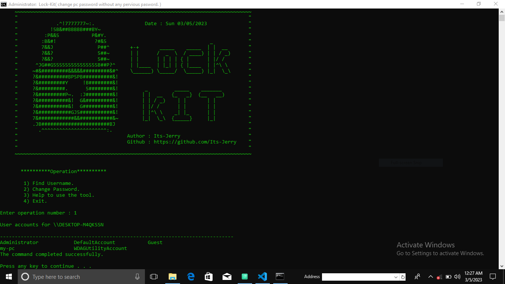
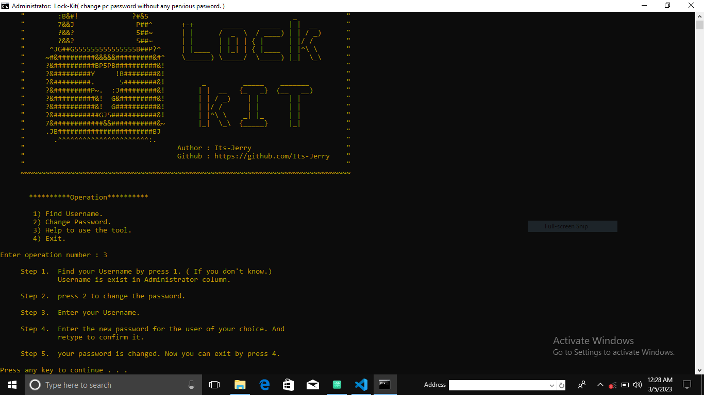

# LOCK-KIT 
Change Your WIndows pc password without any pervious pasword.

# What is LOCK-KIT? 

The LOCK-KIT tool is basically used to set or reset the Windows users password without knowing any previous password. 


## Screenshot
Screenshot 1.
   
Screenshot 2.



## Authors

- [Its-Jerry](https://github.com/Its-Jerry)


## Installation

- Step 1. Clone the code by git clone. 

```bash
  # Just simply download it by the git clone. And clone it
       
git clone https://github.com/Its-Jerry/LOCK-KIT.git 
```
   ( You can also download the zip file directly. ) 

- Step 2. You can see the lock-kit.bat file. Right click
        on it. And Run it As Adminstrator mode. And use it.

- Step 3. If you want help about the tool.
so you Press 3 and then Press Enter. You see a help section. You can read it for help.

    
## Features

 - User friendly interface.
 - Reset multiple users password.
 - Check the list of users avilable in your system.
 - Easily see the details about the the users like ( type of Account ).

## Testing 

This tool is tested on :

- Windows 7
- Windows 8
- Windows 8.1
- Windows 10 ( All Versions )
- Windows 11 ( All versions )


###    I hope you will use this tool very efficiently.
